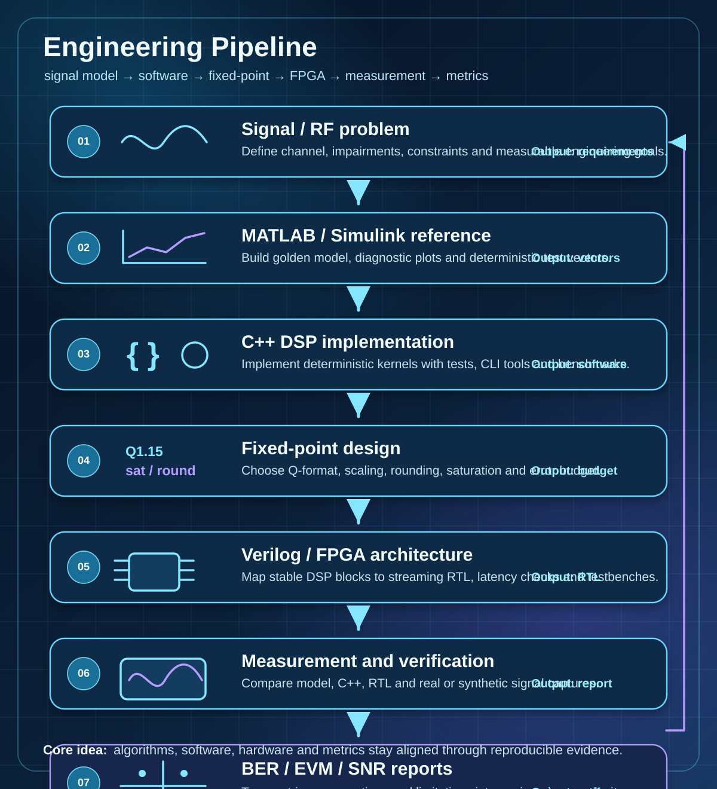

# Alexander | Lay007

**DSP / FPGA / Communications Engineer**  
Candidate of Technical Sciences  
C++ • Verilog • MATLAB/Simulink • Fixed-Point DSP • Circuit Design • Information Security

**LinkedIn:** [Alexander Lyubko DSP](https://ru.linkedin.com/in/alexander-lyubko-dsp)

I build reproducible DSP and communication-system pipelines: from MATLAB/Simulink reference models to C++ implementations, Verilog/FPGA architecture, measurements, BER/EVM/SNR analysis, and engineering documentation.

---

## Current flagship result

The [`zynq-sdr-course`](https://github.com/Lay007/zynq-sdr-course) now includes a complete in-fabric QPSK modem validated on two independent Zynq-7020 + AD936x boards over a 915 MHz cabled RF link.

- Fabric loopback: 5.6 million bits, zero errors, with a reported BER upper bound below `5.34e-7`.
- Two-board differential QPSK: whole-burst rotation failures eliminated, payload BER about `4e-4`.
- Reproducible evidence: RTL regression tests, captured data, machine-readable result JSON, timing/resource reports, and a filled final measurement report.

---

## 60-second reviewer snapshot

| Signal I want to show | Evidence in the portfolio |
|---|---|
| **I can connect theory to hardware** | Complete QPSK modem path from DSP model through fixed-point RTL to a measured two-board Zynq/AD936x RF link |
| **I can implement DSP, not only describe it** | C++ DSP kernels with tests, benchmark tooling, and generated reports |
| **I can verify engineering systems** | MATLAB/C++/RTL alignment, deterministic vectors, CI checks, and metric-driven validation |
| **I can work with real measurements** | BER, EVM, SNR, jitter, latency, timestamp accuracy, and error-budget reporting |
| **I can turn R&D into documentation** | MkDocs sites, IEEE-style figures, experiment manifests, reviewer checklists and publication-oriented reports |

---

## 10-minute portfolio review path

| Step | Open | What to check |
|---:|---|---|
| 1 | [zynq-sdr-course](https://github.com/Lay007/zynq-sdr-course) | End-to-end route from DSP model to HDL, Zynq/AD9363 and measurement reports |
| 2 | [cpp-dsp-showcase](https://github.com/Lay007/cpp-dsp-showcase) | C++ DSP kernels, tests, benchmarks and CMake packaging |
| 3 | [optical-demodulator](https://github.com/Lay007/optical-demodulator) | Coherent optical DSP, CDC comparison, BER/EVM/SNR methodology and paper assets |
| 4 | [network-quality-assessment](https://github.com/Lay007/network-quality-assessment) | SLA traces, timestamp credibility and synthetic reporting demo |
| 5 | [script-toolbox](https://github.com/Lay007/script-toolbox) | Repeatable Windows/SSH/Git automation and PowerShell quality gates |

Use this path when you want a fast technical review instead of a complete repository-by-repository audit.

---

## Best evidence to review first

| Start here | What it proves | Status |
|---|---|---|
| [zynq-sdr-course](https://github.com/Lay007/zynq-sdr-course) | End-to-end SDR education and engineering workflow from DSP model to FPGA/RF measurement | Flagship / active |
| [cpp-dsp-showcase](https://github.com/Lay007/cpp-dsp-showcase) | Modern C++ DSP kernels with tests, benchmarks, CMake packaging and reproducible reports | Active showcase |
| [optical-demodulator](https://github.com/Lay007/optical-demodulator) | Coherent optical DSP research path with CDC, BER/EVM/SNR methodology and IEEE-style artifacts | Research / active |
| [network-quality-assessment](https://github.com/Lay007/network-quality-assessment) | Measurement credibility for latency, jitter, packet loss and timestamp-analysis workflows | Engineering demo |
| [cpp-git-cmake-course](https://github.com/Lay007/cpp-git-cmake-course) | Beginner route into Git, C++, CMake and CI before SDR/FPGA work | Teaching track |
| [LRD257_CODER](https://github.com/Lay007/LRD257_CODER) | MATLAB FEC coding, GF(257), LoRa control-frame adapter and HDL-oriented decomposition | Research utility |
| [script-toolbox](https://github.com/Lay007/script-toolbox) | Repeatable Windows/SSH/Git/developer-machine setup automation with quality gates | Infrastructure toolkit |

---

## What I can deliver

| Area | Deliverable |
|---|---|
| DSP algorithms | reference model, plots, metrics, fixed-point notes and test vectors |
| FPGA / RTL | streaming architecture, Verilog modules, testbenches, resource/timing reports |
| SDR systems | signal chain design, capture workflow, IQ metadata, RF measurement report |
| C++ DSP | reusable library code, CMake packaging, unit tests, benchmark report |
| Engineering documentation | reviewer path, acceptance checklist, experiment manifests and publication-ready figures |

---

## Mini case studies

| Case | Problem | Engineering approach | Evidence |
|---|---|---|---|
| SDR education pipeline | Beginners often know DSP, FPGA and RF as separate fragments | Built a course route from signal theory to fixed-point, HDL, Zynq/AD9363, IQ data and reports | [zynq-sdr-course](https://github.com/Lay007/zynq-sdr-course) |
| C++ DSP validation | DSP code is easy to demonstrate but hard to trust without tests and metrics | Created small deterministic DSP kernels with CMake, tests, benchmarks and package export | [cpp-dsp-showcase](https://github.com/Lay007/cpp-dsp-showcase) |
| Optical receiver research | Coherent optical DSP needs traceable metrics before publication | Organized MATLAB/C++/RTL-oriented workspace with BER/EVM/SNR methodology and paper assets | [optical-demodulator](https://github.com/Lay007/optical-demodulator) |
| Measurement credibility | Network delay/jitter results are often polluted by host-side uncertainty | Built a trace/report workflow focused on timestamping, SLA metrics and synthetic-vs-real validation | [network-quality-assessment](https://github.com/Lay007/network-quality-assessment) |

---

## Engineering Pipeline

| Stage | Engineering result |
|---|---|
| **Signal / RF problem** | define channel, impairments, constraints, and measurable goals |
| **MATLAB / Simulink model** | build readable golden reference, diagnostic plots, and test vectors |
| **C++ implementation** | create deterministic, testable, reproducible software processing |
| **Fixed-point design** | define Q-format, rounding, saturation, and error budget |
| **Verilog / FPGA architecture** | map stable DSP blocks to streaming RTL and testbenches |
| **Measurement and verification** | compare model, software, RTL, and real/synthetic signals |
| **BER / EVM / SNR reports** | turn experiments into engineering conclusions and publication-ready artifacts |

Additional portfolio structure notes are available in [docs/engineering-portfolio-map.md](docs/engineering-portfolio-map.md).

---

## Featured repositories

| Repository | Focus | Why it matters |
|---|---|---|
| [zynq-sdr-course](https://github.com/Lay007/zynq-sdr-course) | SDR course, Zynq/AD9363, HDL, RF measurements | End-to-end path from signal theory to FPGA/RF experiments |
| [cpp-dsp-showcase](https://github.com/Lay007/cpp-dsp-showcase) | Modern C++ DSP kernels | Tests, benchmarks, CMake packaging and reproducible DSP evidence |
| [optical-demodulator](https://github.com/Lay007/optical-demodulator) | Coherent optical DSP | CDC comparison, BER/EVM/SNR methodology, MATLAB/C++/RTL migration path |
| [network-quality-assessment](https://github.com/Lay007/network-quality-assessment) | Network latency/jitter methodology | Measurement credibility, trace schema and timestamp-analysis workflow |
| [script-toolbox](https://github.com/Lay007/script-toolbox) | Windows/SSH/Git setup automation | Repeatable workstation and build-host setup with safety checks |

---

## Engineering Proof

| Proof artifact | Repository | What it demonstrates |
|---|---|---|
| Flagship reviewer report + experiment manifests + CI checks | [zynq-sdr-course](https://github.com/Lay007/zynq-sdr-course) | reproducible SDR labs, evidence map and acceptance criteria |
| Reviewer quick check + DSP test-vector strategy + benchmark schema | [cpp-dsp-showcase](https://github.com/Lay007/cpp-dsp-showcase) | deterministic C++ DSP validation and performance reporting |
| Synthetic SLA demo + reviewer acceptance checklist | [network-quality-assessment](https://github.com/Lay007/network-quality-assessment) | measurement credibility, trace schema and hardware/software timestamp analysis |
| CDC promotion gates + IEEE experiment plan | [optical-demodulator](https://github.com/Lay007/optical-demodulator) | MATLAB/C++/RTL validation, CDC, BER/EVM/SNR methodology |
| PowerShell CI + safety policy + script release checklist | [script-toolbox](https://github.com/Lay007/script-toolbox) | repeatable engineering workstation automation with reviewable checks |
| Engineering acceptance checklist | [LRD257_CODER](https://github.com/Lay007/LRD257_CODER) | MATLAB/Simulink-oriented FEC prototype with clear limits before hardware-ready claims |

---

## Current focus areas

- DSP/FPGA research and prototyping for SDR, telecom and measurement systems.
- MATLAB/Simulink reference models with a clear migration path to fixed-point and RTL.
- C++ DSP implementations with deterministic tests, benchmark reports and CI.
- Engineering documentation that makes experiments reproducible and reviewable.
