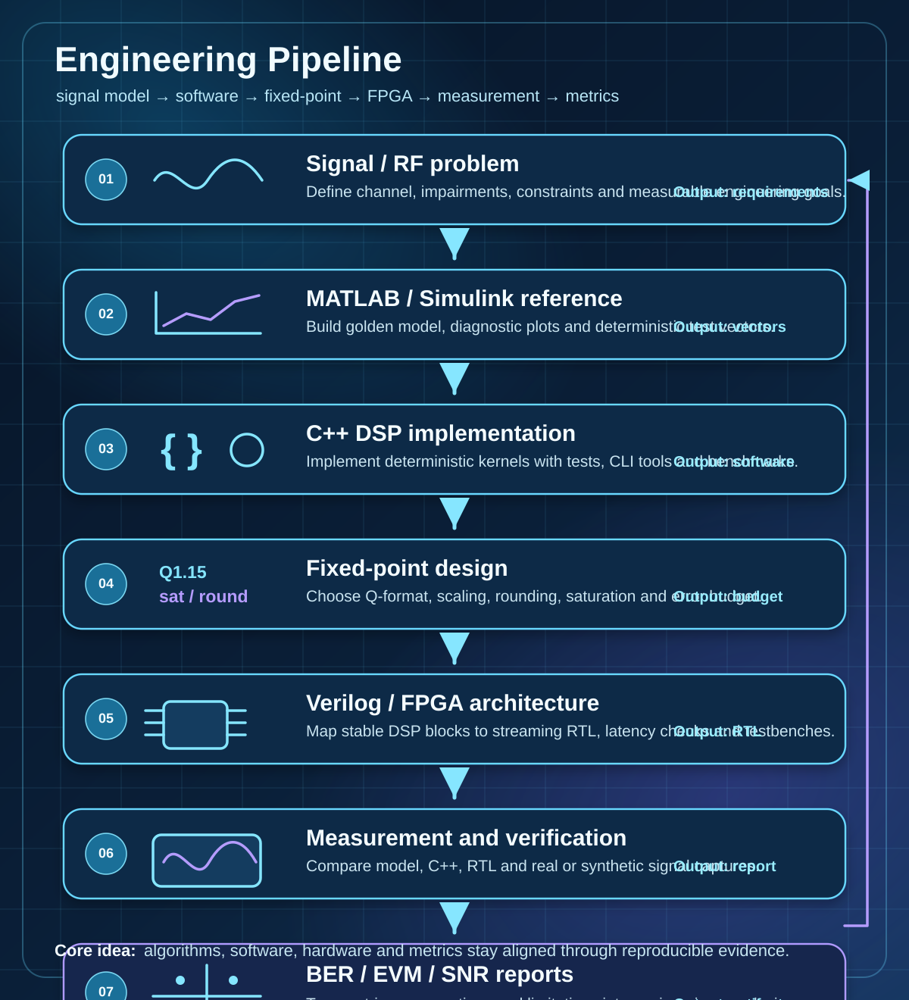

# Alexander | Lay007

**DSP / FPGA / SDR Engineer**  
Communication systems • Fixed-point DSP • Zynq/AD936x • C++ • Verilog • MATLAB/Simulink  
Candidate of Technical Sciences — a research degree broadly comparable to a PhD

[LinkedIn](https://linkedin.com/in/alexander-lyubko-dsp) · [Engineering portfolio](https://lay007.github.io) · [Case studies](https://lay007.github.io/case-studies.html) · [laymob@gmail.com](mailto:laymob@gmail.com)

I help R&D teams turn DSP and communication algorithms into verified C++/RTL/FPGA implementations. My work is evidence-driven: reference models, deterministic test vectors, fixed-point design, FPGA/SDR integration, measurements, and reproducible engineering reports.

## Selected engineering results

- **Zynq/AD936x QPSK:** 5.6 million fabric-loopback bits with zero errors; reported BER upper bound below `5.34e-7`.
- **Two-board RF link:** differential QPSK over a 915 MHz cabled link with whole-burst rotation failures eliminated and payload BER around `4e-4`.
- **LoRa/SX1262 → ZynqSDR (M9):** 732/732 captured packets passed payload CRC across the 500-attempt and overnight hardware campaigns, with zero detection misses.
- **FPGA timing:** a continuous PL sample-time counter was verified across 47 captures spanning 803.7 s.
- **Traceable implementation flow:** MATLAB/Simulink reference models → fixed-point design → generated/manual RTL → Zynq/AD936x → RF/IQ measurements.

## What I do

- **DSP / FPGA R&D** — algorithm design, fixed-point implementation, C++/RTL development, verification, and measurable acceptance criteria.
- **MATLAB / Simulink → hardware** — reference models, numerical design, test vectors, HDL-oriented architecture, generated RTL, and Zynq integration.
- **Technical review and debugging** — focused work on DSP, SDR, synchronization, RF/IQ measurement, FPGA implementation, and reproducibility problems.

For focused R&D, consulting, or technical review work, contact me via [email](mailto:laymob@gmail.com) or [LinkedIn](https://linkedin.com/in/alexander-lyubko-dsp).

## Flagship projects

### [zynq-sdr-course](https://github.com/Lay007/zynq-sdr-course)

An end-to-end SDR engineering course and evidence base built around Zynq-7020 + AD936x. It connects signal theory, DSP models, fixed-point design, Verilog/FPGA, RF integration, IQ capture, and measurement reporting.

The in-fabric QPSK modem is validated on two independent boards over a controlled RF path, with reproducible RTL tests, machine-readable results, timing/resource reports, and measurement documentation.

### [zynq-lora-phy-positioning](https://github.com/Lay007/zynq-lora-phy-positioning)

A LoRa PHY and ToA/TDoA positioning research platform with a traceable MATLAB → Simulink → generated Verilog → ZynqSDR path.

The current implementation includes continuous-IQ acquisition, LoRa decoding, BER/PER evaluation, fractional ToA, fixed-point streaming processing, generated HDL, hardware packet reception, and PL timestamp metadata. M9 adds fractional-CFO derotation before the bin decision plus split-preamble recovery; on hardware, the 500-attempt series produced 492/492 CRC-valid captures with zero misses, and the combined series500 + overnight evidence reached 732/732 CRC-valid packets with zero misses.

The next research milestones are controlled delay calibration, inter-receiver synchronization and synchronized multi-receiver TDoA; the repository does not yet claim calibrated hardware positioning.

## Start here

| Repository | What it demonstrates |
|---|---|
| [zynq-sdr-course](https://github.com/Lay007/zynq-sdr-course) | DSP model → fixed-point RTL → Zynq/AD936x → RF measurement |
| [zynq-lora-phy-positioning](https://github.com/Lay007/zynq-lora-phy-positioning) | LoRa PHY, real IQ, generated HDL, precise timing, ToA/TDoA research |
| [cpp-dsp-showcase](https://github.com/Lay007/cpp-dsp-showcase) | Modern C++ DSP kernels, deterministic tests, benchmarks, and CMake packaging |
| [network-quality-assessment](https://github.com/Lay007/network-quality-assessment) | Latency/jitter methodology, timestamp credibility, and reproducible reports |
| [script-toolbox](https://github.com/Lay007/script-toolbox) | Repeatable Windows, SSH, Git, and workstation automation |

## Engineering approach

| Principle | Evidence |
|---|---|
| Model before implementation | MATLAB/Simulink and software reference models |
| Share deterministic evidence | Common test vectors across software, RTL, and hardware |
| Measure the real system | BER/PER/EVM/SNR, IQ captures, timestamps, timing/resource reports |
| Preserve provenance | Versioned configurations, manifests, raw counts, and known limitations |
| Make results reviewable | CI, bilingual documentation, experiment guides, and concise case studies |

